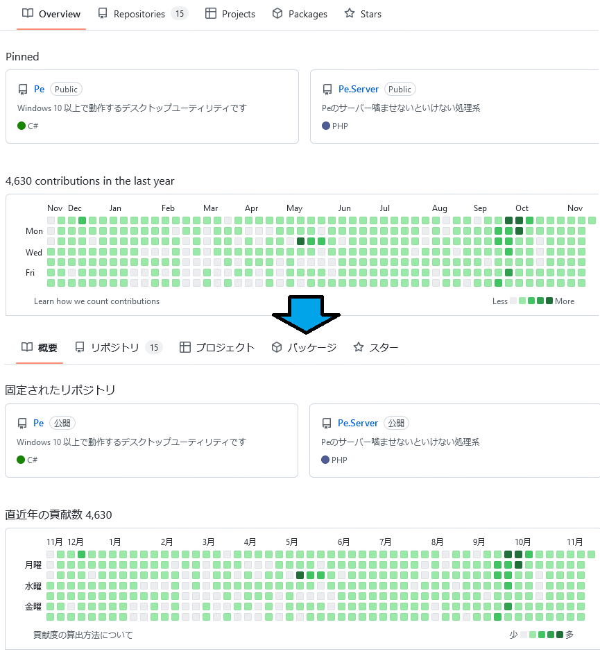

ページの翻訳拡張機能を作った。

* ストア
  * [Firefox](https://addons.mozilla.org/ja/firefox/addon/%E5%AE%9A%E5%9E%8B%E7%BF%BB%E8%A8%B3/)
  * [Chrome](https://chrome.google.com/webstore/detail/ccfdbiagojajdmnnbngkoiobdkcbpgbd)
* ソース
  * [PTD](https://github.com/sk-0520/page-translation-dictionary)
  * [設定(参考実装)](https://github.com/sk-0520/page-translation-dictionary-reference)

## 機能

ページの翻訳機能になるが、普通の翻訳処理と違って設定ファイルから機械的に文言を置き換えていく。

設定ファイルはホスト(対象ドメイン)と表示ページのパスから特定の要素に対して置き換え設定を記述する必要があるので拡張機能自体より設定ファイルの作成・保守の方が難しい感じになってる。

## 対象ブラウザ

一応 Firefox/Chrome で動くには動くように作っているが Chrome の挙動は微妙(特にバックグラウンド処理周り)。

というのも元々 Firefox のみを対象にしていたけど途中で何となく Chrome を対象に含めただけなので Manifest V3 の内容をほぼほぼ理解していない。

### Firefox

* このブラウザほんと存在感無くなってて悲しい
* 〇 [web-ext](https://github.com/mozilla/web-ext) がつよつよ
* 〇 バックグラウンドスクリプトが寛容で無駄なこと考える必要がない
* 〇 アイコンが SVG を許容するのは png 生成とかしなくていいのは楽
  * まぁ結局 Chrome 対応で生成してるけど
* ✖ ID指定しないとデバッグ時の継続実行が不可能なのは
  * 自動でいい感じにしてほしかった
  * MV3 移植の場合の挙動が Chrome と同じかは知らん

### Chrome

* ✖ 開発用の起動オプションが全然ない？(わからんかった)ので少し手間がかかる
  * プロファイル作るごとにデスクトップにアイコン作られるのはどうなんだ(これは制御できそうだけど)
* ✖ バックグラウンドスクリプトがよわよわ
  * 小難しい話はともかくとして、いきなりぶった切られるのはつらい
* △ 拡張機能の互換対応は [webextension-polyfill](https://github.com/mozilla/webextension-polyfill) がつよつよ
  * 出してるの Google じゃなくて Mozilla だし
  * web-ext もそうだけどこの辺は Google 側で作っといてほしい気持ち

## 審査

### Firefox

* 2日くらいで通った
* ソースを添付できたのが多分強かった

### Chrome

* 4日くらいで通った
* ソースを添付できなかった or 見落としていた
* $5 == ¥724 でした。。。 メガネが注視しかしない。。。

## 変な設計

* 設定ファイルの更新をコンテンツスクリプトで行ってる
  * MV3 でのバックグラウンドスクリプトがどう動くか分からなかったので長命っぽいコンテンツスクリプトを最初から対象にしたため
* 設定ファイルが JSONC を受け付ける
  * 参考実装は当初 JSON 手書きだったが `,` で心が折れたので JSONC を受け付けるようにしたけどそれでもしんどくなって TypeScript から JSON を生成するようになったからほぼ死んでる機能
* 設定ファイルが共通テキスト・セレクタを参照する機能がある
  * 手でやるなら必要
  * 参考実装は TypeScript からの生成なので死んでる機能
* テキストノード指定とかの辺りが頭おかしくてしんどい
  * 設計思想として非コンテンツ部分が固定なサイト用(ソース以外は固定な GitHub がそんなサイト)なので当初はそれでよかったけど肝心の GitHub が一意指定難しくてノード指定が必要になるというね
    * 公開する際に GitHub 日本語化対応！ くらい引っ提げていこうと思ったけど無理無理 諦めだいじ

