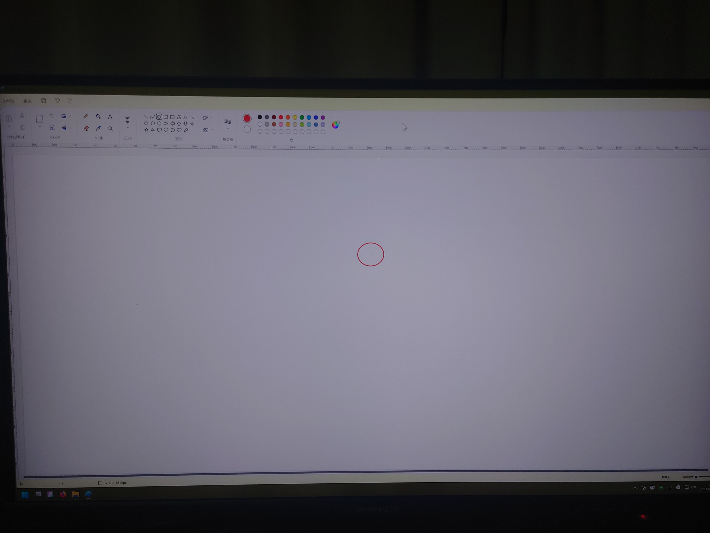

[ダメっぽかったディスプレイ](../../06/09/) のその後の顛末。

1. サポートの確認
   * https://japannext.net/docs/missing_dots/ [web.archive](https://web.archive.org/web/20230618124557/https://japannext.net/docs/missing_dots/)
     > 99.999％以上の有効表示画素がありますが、0.001%以下の画素の問題につきまして は、基本的に正常品となります。
     > 
     > ...(略)...
     > 
     > ただ、ドット抜けやドット常灯（輝点）が数点固まっていて大きさが顕著な場合や、その位置や色によって
     > 使用に著しく支障があると思われる場合は、症状がわかる写真数点とともに、こちらのフォームよりお問い合わせください。
2. 微妙だったけど中央近くで非常に鬱陶しかったので写真撮ってダメ元連携
   * 
   * 
   * 注釈
     * 赤枠内が困っていたところ
     * 赤枠外のあからさまな黒色は単純な汚れ
     * 先方に連携した画像そのまま(ビルド工程で最適化されてるかもしれないけど + レシートはここでは除外)
3. **交換してくれた！！**
4. 交換品を使用したところドット落ちなしで非常に満足している

サポート問い合わせから交換までは非常にスムーズで個人的にすっごいありがたい対応だったのでこのまま無事に稼働してくれれば使い続けることになりそう。  
※他の人にもお勧めしたいところなんだけど、サンプル数が個人1(+1)なのでこれが稀なのかよくあることなのか不明過ぎてまだ信者にはなれない
